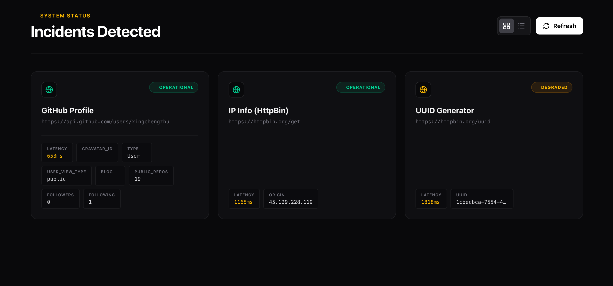

<div align="center">

  # ⚡ Status Lite
  
  **A lightweight, serverless status page for your services.**
  <br>
  **轻量级、无后端的服务状态监控面板。**

  [](https://react.dev)
  [](https://tailwindcss.com)
  [](https://www.framer.com/motion/)

  [**🚀 Live Demo**](https://status-lite.vercel.app)
  
  <br>
</div>

---



## 📖 Introduction

**Status Lite** is a modern, pure-frontend status dashboard designed for developers who need to monitor their APIs, websites, or services without setting up complex backend infrastructure.

It leverages **browser-native Fetch API** to perform real-time health checks and stores configuration locally using `localStorage`. With its "Bento Grid" layout and glassmorphism design, it looks professional right out of the box.

**Status Lite** 是一个现代化的纯前端状态仪表盘。它不需要复杂的后端部署，直接利用浏览器的 Fetch API 进行实时健康检查，并支持本地持久化配置。

## ✨ Features

* **⚡ Serverless & Lightweight:** No database required. Runs entirely in the browser.
* **🔍 Real-time Monitoring:** Checks service health (Latency, Status Code) via direct HTTP requests.
* **🧠 Smart Metrics:** Automatically extracts key metrics (e.g., *Followers, Version, Region*) from JSON API responses.
* **🎨 Bento Grid UI:** A responsive, modern grid layout that adapts to any screen size.
* **🔄 View Switcher:** Toggle between **Grid View** (Visual) and **List View** (Compact) with smooth animations.
* **🛡️ Admin Mode:** Built-in management interface to Add, Edit, or Delete monitors directly from the UI.
* **🌑 Dark Mode:** Optimized dark theme with neon glows and glassmorphism effects.

## 🚀 Getting Started

1.  **Clone the repository**
    ```bash
    git clone https://github.com/xingchengzhu/status-lite.git
    cd status-lite
    ```

2.  **Install dependencies**
    ```bash
    npm install
    ```

3.  **Run development server**
    ```bash
    npm run dev
    ```

## 🎮 How to Use

### 1. Admin Mode
* Click the **Settings / Gear Icon** in the bottom-right corner to toggle **Admin Mode**.
* In Admin Mode, you can **Add** new services or **Delete** existing ones.

### 2. Adding a Monitor
* **Name:** Display name (e.g., "GitHub API").
* **URL:** The endpoint to check (e.g., `https://api.github.com/zen`).
    * *Note: Ensure the target API supports CORS (Cross-Origin Resource Sharing).*

### 3. View Modes
* Click the **Grid/List** toggle in the top-right corner to switch layouts.
    * **Grid:** Best for large screens and dashboards.
    * **List:** Best for comparing multiple metrics side-by-side.

## 🛠️ Tech Stack

* **Core:** React 19 + Vite
* **Styling:** Tailwind CSS v4
* **Animation:** Framer Motion (Layout transitions, LayoutGroup)
* **Icons:** Lucide React
* **Utils:** `clsx`, `tailwind-merge`

## 📄 License

MIT License.

---
<div align="center">
  <sub>Built with ❤️ by <a href="https://github.com/xingchengzhu">Xingcheng Zhu</a></sub>
</div>